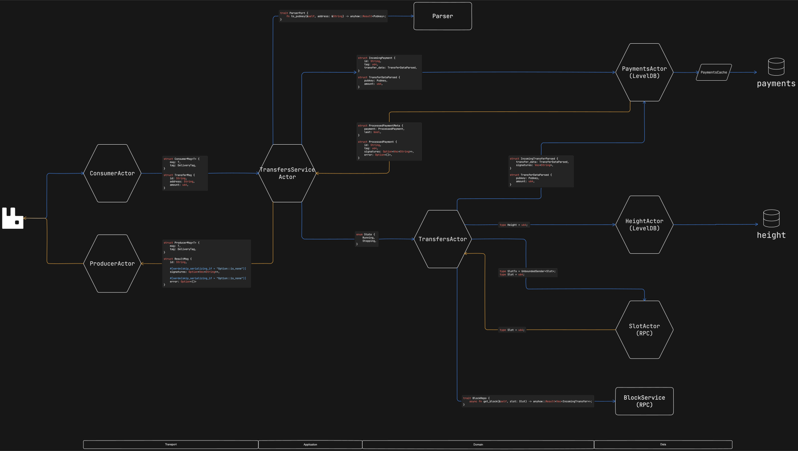

# [txchecker] - A service for online payments via blockchain transactions

## [architecture]

 

## [description]

Each blockchain operates with its own queue to maintain independence from others. The binary can be compiled for a specific blockchain, disabling chain-specific dependencies using Rust features. For example: `cargo build --features solana`. This setup is beneficial when each cryptocurrency runs as a separate Kubernetes pod, reducing deployment time and enhancing independence. The service is designed using the Actor Model and Domain-Driven Design (DDD) principles to minimize dependencies between layers and logical units.

## [actors]

### [transport]
- **ConsumerActor** - A versatile actor that consumes messages from the queue and deserializes them into the sender channel type. Each queue has its own actor and connection to the RabbitMQ cluster.
- **ProducerActor** - Produces messages into the queue and commits processed payments.

### [application]
- **TransfersServiceActor** - Maps transport layer messages to domain entities and sends them to the LevelDB backup actor. It transitions the system state to "Stopping" if no payments are left to process. Additionally, it maps processed payments to output messages and sends them to the ProducerActor. This actor contains common logic for all blockchains and is completely separate from specific domain business logic.

### [solana.domain]
- **TransfersActor** - Processes incoming transfers to the LevelDB backup service. Subscribes to slot updates from the SlotActor and retrieves incoming transfers for each block through the BlockRepo. It can be in either "Running" or "Stopping" states, depending on the availability of payments to check.
- **Parser** - A simple, domain-specific address to Pubkey parser. The Pubkey is used in the persistence layer as a key for backing up the current state of the destination wallet.

### [solana.data]
- **SlotActor** - Determines the latest slot from the network and sends it to the subscriber, particularly the TransfersActor.
- **BlockService** - Retrieves block metadata, maps it to the domain entity, and returns it to the caller.

### [data]
- **PaymentsActor** - Accepts incoming payments and stores them in the backup cache. It also receives incoming transfers, updates the payment state, and retains it until the entire amount is paid. It includes an in-memory cache to reduce the number of load operations.
- **HeightActor** - Receives the latest height and backs it up to LevelDB. Upon application startup, it determines this slot, which can be passed to domain-dependent services as a starting point.